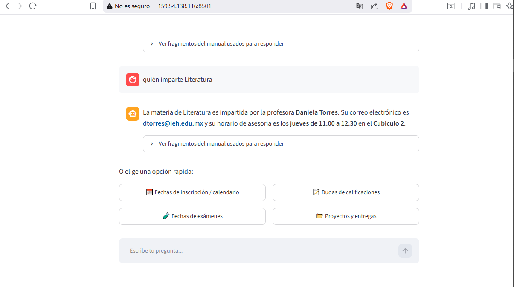
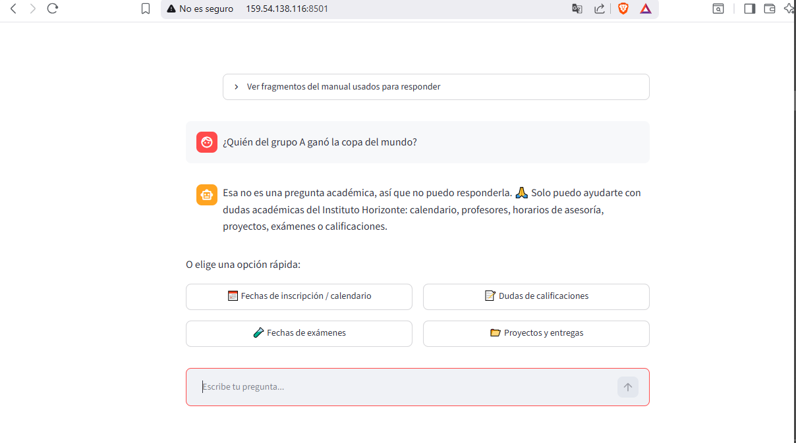

# Agente Académico — Instituto Educativo Horizonte

Agente que responde preguntas en lenguaje natural sobre el manual
académico del semestre (calendario, profesores, proyectos, calificaciones)
usando RAG (Retrieval-Augmented Generation).

## Arquitectura
1. El PDF se divide en fragmentos con LangChain (`RecursiveCharacterTextSplitter`).
2. Cada fragmento se convierte en un embedding con `sentence-transformers`
   (modelo `all-MiniLM-L6-v2`, corre localmente, sin costo).
3. Los embeddings se guardan en un índice FAISS.
4. Ante una pregunta, se recuperan los fragmentos más relevantes y se
   envían junto con la pregunta al modelo de lenguaje (Cohere `command-a-03-2025`).
5. Antes de buscar en el documento, un filtro con el mismo modelo detecta si
   la pregunta es académica; si no lo es, el agente responde que no puede
   ayudar con eso.
6. Streamlit expone todo esto como una aplicación de chat, con saludo inicial
   y botones de preguntas rápidas.

## Capturas de pantalla

**1. Pantalla de inicio**

Saludo inicial, botones de opciones rápidas y cuadro para escribir la pregunta.

**2. Botón "Fechas de inscripción / calendario"**

Respuesta con las fechas importantes del calendario escolar del semestre.

**3. Botón "Dudas de calificaciones"**

Respuesta explicando dónde consultar calificaciones y qué hacer ante un desacuerdo.

**4. Botón "Proyectos y entregas"**

Respuesta con los proyectos a entregar en el semestre, por materia y fecha.

**5. Botón "Fechas de exámenes"**

Respuesta con los periodos de exámenes parciales y finales.

**6. Pregunta abierta (académica)**

El agente responde correctamente a una pregunta escrita libremente: "¿Quién imparte Literatura?"

**7. Filtro de preguntas no académicas**

Ante una pregunta no académica ("¿Quién del grupo A ganó la copa del mundo?"), el agente
identifica que no está relacionada con el manual y explica que no puede responderla.

## Ejemplos de preguntas
- "¿Cuáles son las fechas importantes del calendario escolar de este semestre?" --puedes utilizar el botón de Fechas inscripcion/calendario 
- "¿Dónde consulto mis calificaciones y qué hago si no estoy de acuerdo con una?" --puedes utilizar el botón de Dudas calificaciones
- "¿Qué proyectos tengo que entregar este semestre, de qué materias y cuándo?" -- puedes utilizar el botón Proyectos y entregas
- quién imparte Literatura -- esta es una pregunta abierta
- "quién del grupo A ganó la copa del Mundo" → el agente responde que solo puede ayudar con dudas académicas.

## Cómo ejecutar el proyecto localmente
1. Clonar el repositorio y entrar a la carpeta.
2. `python -m venv venv` y activarlo.
3. `pip install -r requirements.txt`
4. Copiar `.env.example` a `.env` y colocar tu propia clave de Cohere.
5. `streamlit run app.py`

## Deploy en producción
La aplicación está desplegada en una instancia de Oracle Cloud (OCI Compute):

**http://159.54.138.116:8501**

(Nota: al ser `http` sin cifrado, el navegador puede mostrar una advertencia
de "sitio no seguro" — es esperado para este proyecto de prueba.)

