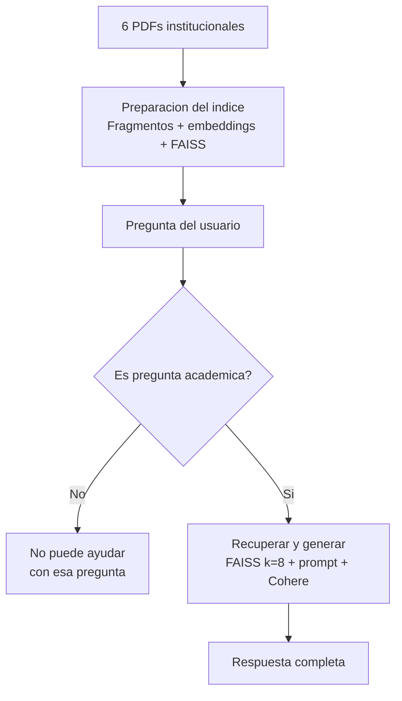

# Agente Académico — Instituto Educativo Horizonte

Agente de IA que responde preguntas en lenguaje natural sobre los documentos
oficiales del Instituto Educativo Horizonte, usando RAG (Retrieval-Augmented
Generation).

## Documentos fuente

El agente consulta 6 documentos PDF:

1. `manual_academico_instituto_horizonte.pdf` — calendario, profesores, proyectos, calificaciones.
2. `reglamento_del_estudiante.pdf` — derechos, obligaciones, asistencia y disciplina.
3. `politica_reembolso_matriculas.pdf` — plazos y porcentajes de reembolso.
4. `faq_cursos_certificados.pdf` — preguntas frecuentes sobre cursos y certificados.
5. `guia_uso_plataforma.pdf` — cómo usar el Portal Académico.
6. `programa_becas_afiliados.pdf` — tipos de becas y convenios con empresas afiliadas.

## Tecnologías utilizadas

- **Python 3.12**
- **LangChain 1.0** (`langchain-classic`, `langchain-community`, `langchain-text-splitters`, `langchain-cohere`)
- **PyPDF** — lectura de los documentos PDF
- **FAISS** — índice vectorial para la búsqueda semántica
- **sentence-transformers** (`all-MiniLM-L6-v2`) — generación de embeddings, local y gratuito
- **Cohere** (`command-a-03-2025`) — modelo de lenguaje
- **Streamlit** — interfaz de chat web
- **python-dotenv** — manejo seguro de la clave de API
- **GitHub** — control de versiones
- **Oracle Cloud Infrastructure (OCI)** — servidor de despliegue (Compute + Networking)
- **Nginx + Certbot (Let's Encrypt) + DuckDNS** — proxy inverso, HTTPS y dominio propio para producción

## Arquitectura

1. Cada PDF se lee con LangChain (`PyPDFLoader`) y **se unen todas sus páginas
   en un solo texto por documento** antes de dividirlo — esto es clave: si se
   divide por página primero, una tabla que empieza en una página y termina en
   la siguiente puede quedar partida a la mitad.
2. Ese texto completo se divide en fragmentos con `RecursiveCharacterTextSplitter`
   usando un `chunk_size` generoso (4000 caracteres). Como los 6 documentos son
   cortos, la mayoría queda en un solo fragmento completo (el manual académico,
   un poco más largo, se divide en 2).
3. Cada fragmento se convierte en un embedding con `sentence-transformers`
   (modelo `all-MiniLM-L6-v2`, corre localmente, sin costo) y se guarda en un
   índice FAISS.
4. Ante una pregunta, un filtro con el modelo de lenguaje detecta primero si es
   académica/administrativa; si no lo es, el agente responde que no puede
   ayudar con eso.
5. Si la pregunta es académica, se recuperan los fragmentos más relevantes
   (`k=8`, más que el total de fragmentos que existen, por lo que en la
   práctica siempre se recupera todo el contenido disponible) y se envían
   junto con la pregunta a un modelo de lenguaje (Cohere `command-a-03-2025`),
   usando una **plantilla de instrucción personalizada** que le exige
   responder de forma completa (incluir todos los elementos de una lista o
   tabla, y revisar también secciones relacionadas aunque no estén en la misma
   tabla — por ejemplo, incluir el proyecto final institucional además de los
   proyectos por materia).
6. Streamlit expone todo esto como una aplicación de chat, con saludo inicial
   y 6 botones de preguntas rápidas.



> **Nota sobre el proceso:** este proyecto pasó por varias iteraciones de
> ajuste (tamaño de fragmento, número de resultados recuperados, búsqueda
> híbrida con palabras clave, MMR) hasta encontrar la combinación que da
> respuestas completas de forma consistente. El archivo `diagnostico.py`
> incluido en este repositorio permite verificar en cualquier momento cuántos
> fragmentos se generan y cuáles se recuperan para una pregunta dada.

## Capturas de pantalla Agente Académico en Producción

**1. Pantalla de inicio**


**2. Botón "Fechas de inscripción / calendario"**


**3. Botón "Dudas de calificaciones"**


**4. Botón "Proyectos y entregas"**


**5. Botón "Fechas de exámenes"**


**6. Botón "Becas y afiliados"**


**7. Botón "Reembolso de matrícula"**


**8. Pregunta abierta: "quien imparte literatura" (minúsculas)**


**9. Pregunta abierta: "quién imparte Química II y en qué horario da asesorías"**


**10. Filtro de preguntas no académicas**


## Ejemplos de preguntas y respuestas

**Pregunta:** "¿Quién imparte Química II y en qué horario da asesorías?"
**Respuesta:** "La materia de Química II es impartida por la profesora Ana Sofía Reyes. Sus asesorías se llevan a cabo los viernes de 10:00 a 12:00 horas en el Laboratorio B.

Detalles adicionales del contexto:

Correo de contacto: areyes@ieh.edu.mx.
Esta información se encuentra en la sección 2. Materias, profesores y horarios de asesoría del Manual Académico del Estudiante, Semestre Agosto – Diciembre 2026.

**Pregunta:** "¿Qué tipos de becas ofrece el instituto y cuáles son los
requisitos de cada una?"
**Respuesta:** 
El Instituto Educativo Horizonte ofrece los siguientes tipos de becas, cada una con sus requisitos específicos:

Beca académica de excelencia

Cobertura: 50% de colegiatura.
Requisito principal: Promedio general mínimo de 9.5 en el semestre anterior.
Beca socioeconómica

Cobertura: Del 20% al 60% de colegiatura, según estudio socioeconómico.
Requisito principal: Presentar estudio socioeconómico y comprobantes de ingresos familiares.
Beca deportiva y cultural

Cobertura: 30% de colegiatura.
Requisito principal: Representar al instituto en competencias deportivas o culturales oficiales.
Beca hermanos

Cobertura: 15% de colegiatura por cada hermano inscrito.
Requisito principal: Dos o más hermanos inscritos simultáneamente en el instituto.
Requisitos generales para todas las becas:

Estar inscrito y al corriente en el pago de colegiaturas al momento de solicitar la beca.
No tener sanciones disciplinarias graves o gravísimas vigentes.
Mantener un promedio mínimo de 8.0 durante la vigencia de la beca (excepto la socioeconómica, con criterio propio).
Renovar la solicitud cada semestre.
Procedimiento de solicitud:

Convocatoria: Publicada en el Portal Académico durante las primeras dos semanas de cada semestre.
Solicitud: Realizada en línea en la sección "Trámites → Becas", adjuntando la documentación correspondiente.
Resultados: Publicados dentro de los 20 días hábiles posteriores al cierre de la convocatoria.
Pérdida de la beca:
La beca se cancela si el estudiante reprueba una o más materias, incurre en faltas graves o gravísimas, o deja de cumplir el requisito específico de la beca otorgada.

Para más información, contactar a la Coordinación de Becas y Vinculación en becas@ieh.edu.mx.

**Otras preguntas que el agente responde correctamente:**
- "¿Qué proyectos tengo que entregar este semestre, de qué materias y cuándo?"
**Respuesta:** Ver captura 4. Botón "Proyectos y entregas"
- "¿Cómo solicito el reembolso de mi matrícula?"
**Respuesta:** Ver captura 7. Botón "Reembolso de matrícula"
- "¿Quién ganó el mundial?" → el agente responde que solo puede ayudar con dudas académicas 
**Respuesta:** Ver captura 10.

## Cómo ejecutar el proyecto localmente

### Requisitos previos

- **Python 3.12** instalado (LangChain 1.0 requiere mínimo 3.10).
  Verifica tu versión con en tu consola con:
  python --version

- **Git** instalado.

- Una **clave de API gratuita de Cohere** — regístrate en [dashboard.cohere.com](https://dashboard.cohere.com) → sección "API Keys" → copia la "Trial key".

### 1. Clonar el repositorio
```
git clone https://github.com/TU_USUARIO/agente-academico.git
cd agente-academico
```

### 2. Crear y activar un entorno virtual
Esto aísla las librerías del proyecto del resto de tu computadora.
```
python -m venv venv
```
Actívalo según tu sistema operativo:
- **Windows (PowerShell):** `venv\Scripts\Activate.ps1`
- **Windows (cmd):** `venv\Scripts\activate.bat`
- **Mac/Linux:** `source venv/bin/activate`

Sabrás que quedó activo porque el prompt de tu terminal empieza con `(venv)`.

> Si en PowerShell aparece un error de "ejecución de scripts deshabilitada",
> ejecuta una sola vez `Set-ExecutionPolicy -ExecutionPolicy RemoteSigned -Scope CurrentUser`
> y vuelve a intentar activar el entorno.

### 3. Instalar las dependencias
```
pip install -r requirements.txt
```
Esto puede tardar varios minutos la primera vez (instala librerías pesadas
como `sentence-transformers` y `torch`) — no lo interrumpas aunque parezca
que no avanza.

### 4. Configurar tu clave de API
Copia la plantilla y edítala con tu clave real:
```
cp .env.example .env        # Mac/Linux
copy .env.example .env      # Windows
```
Abre el `.env` recién creado y reemplaza el valor de ejemplo:
```
COHERE_API_KEY=tu_clave_real_de_cohere
```

### 5. Confirmar que los 6 PDFs estén presentes
Deben estar en la misma carpeta que `app.py` (ya vienen incluidos si
clonaste el repositorio completo):
```
manual_academico_instituto_horizonte.pdf
reglamento_del_estudiante.pdf
politica_reembolso_matriculas.pdf
faq_cursos_certificados.pdf
guia_uso_plataforma.pdf
programa_becas_afiliados.pdf
```

### 6. Ejecutar la aplicación
```
streamlit run app.py
```
Se abrirá automáticamente en tu navegador en `http://localhost:8501`. La
primera carga tarda un poco más (construye el índice de búsqueda); las
siguientes veces es inmediata.

### (Opcional) Verificar el sistema de búsqueda
El repositorio incluye `diagnostico.py`, un script que muestra cuántos
fragmentos se generan a partir de los PDFs y cuáles se recuperan para
preguntas de ejemplo — útil para confirmar que todo está funcionando antes
de hacer cambios:
```
python diagnostico.py
```

## Deploy en producción
La aplicación está desplegada en una instancia de Oracle Cloud (OCI Compute),
con un dominio propio y certificado HTTPS (Let's Encrypt) configurado a través
de Nginx como proxy inverso:

**https://agente-horizonte.duckdns.org**