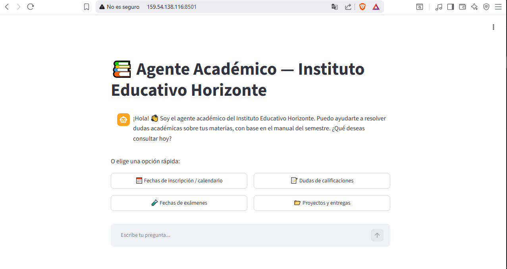
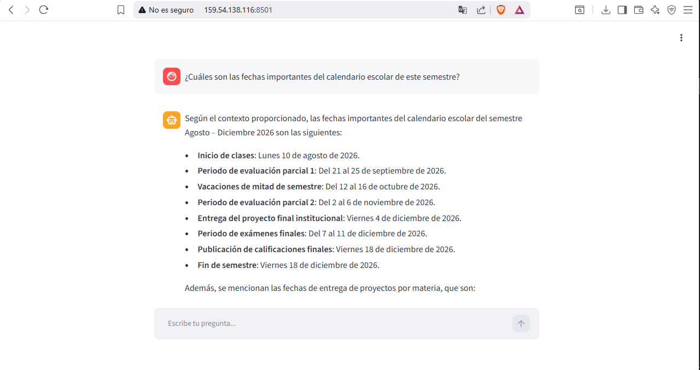
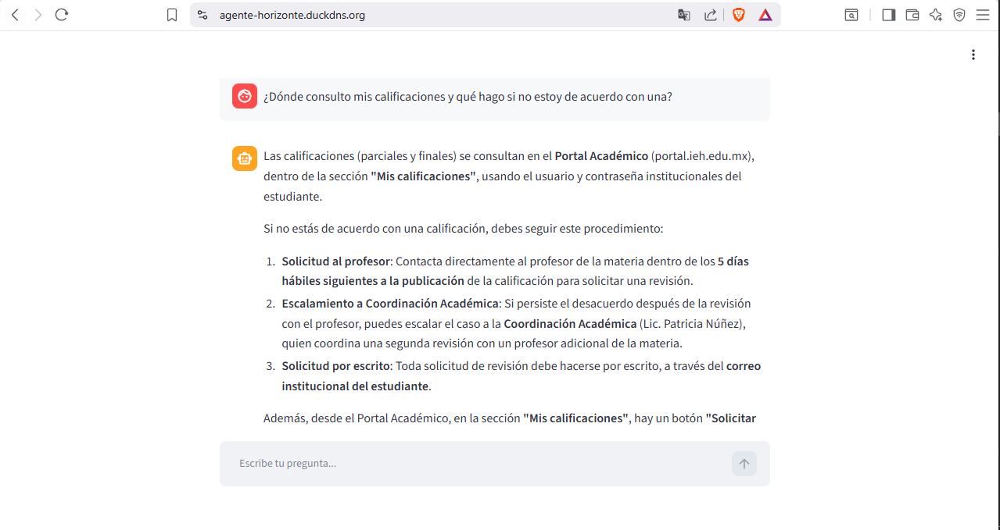
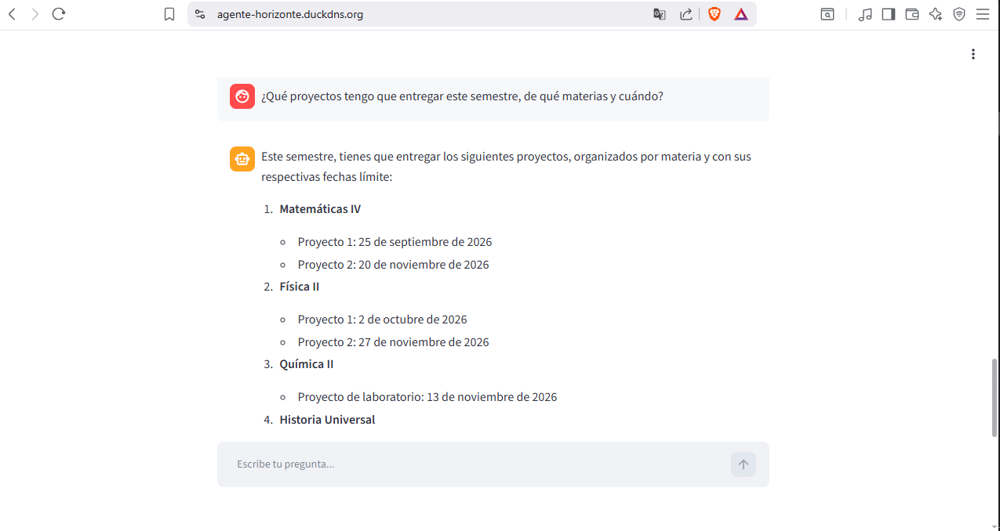
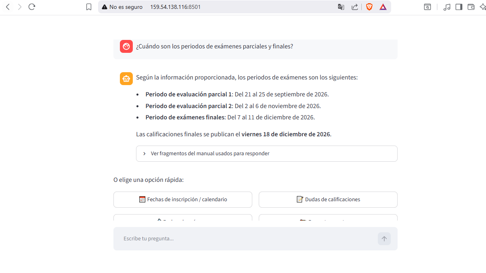
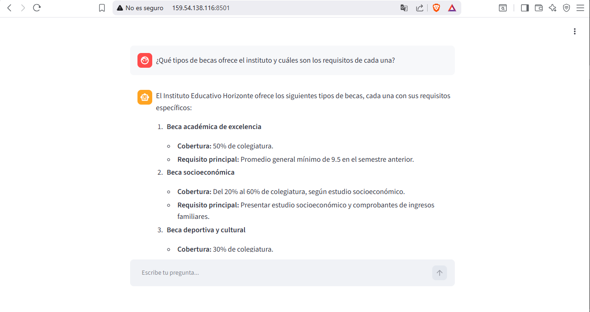
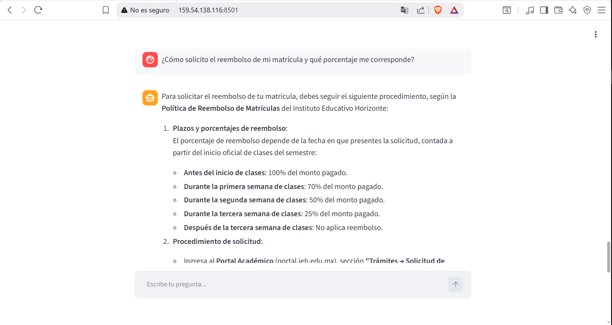
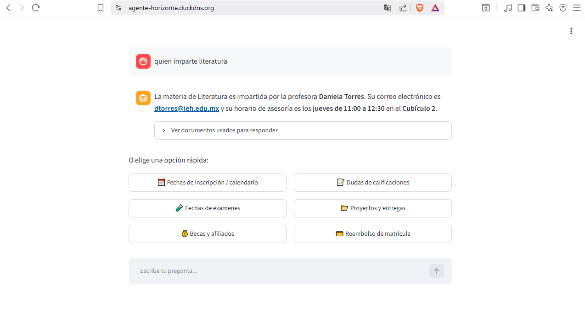
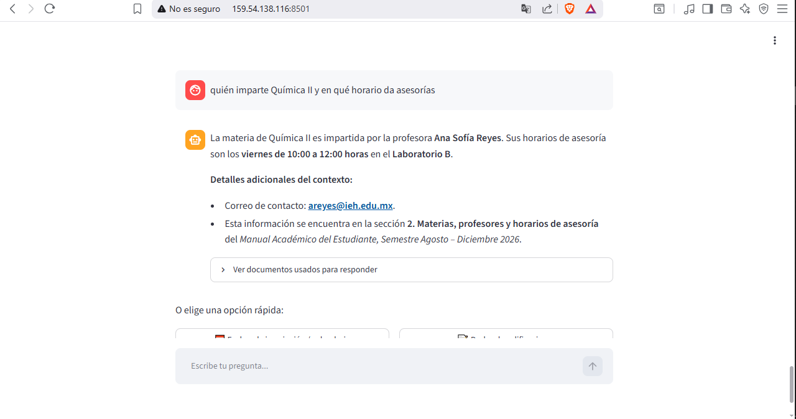
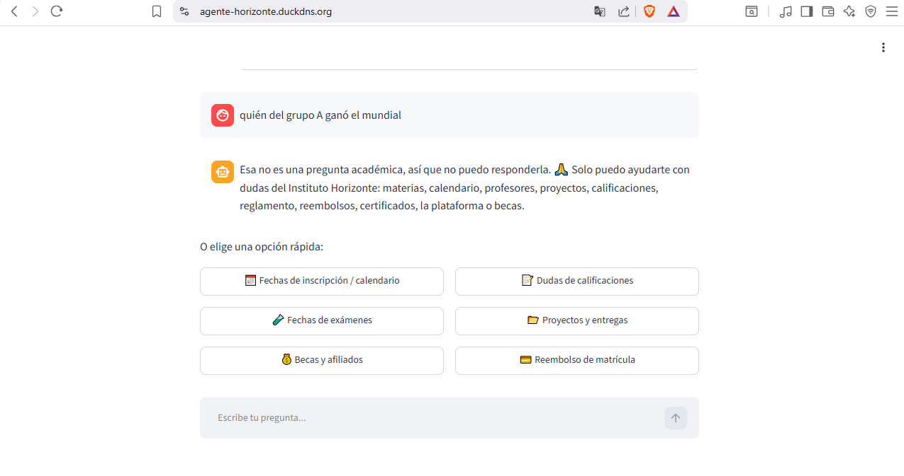

# Agente Académico — Instituto Educativo Horizonte

Agente de IA que responde preguntas en lenguaje natural sobre los documentos
oficiales del Instituto Educativo Horizonte, usando RAG (Retrieval-Augmented
Generation).

## Documentos fuente

El agente consulta 6 documentos PDF:

1. `manual_academico_instituto_horizonte.pdf` — calendario, profesores, proyectos, calificaciones.
2. `reglamento_del_estudiante.pdf` — derechos, obligaciones, asistencia y disciplina.
3. `politica_reembolso_matriculas.pdf` — plazos y porcentajes de reembolso.
4. `faq_cursos_certificados.pdf` — preguntas frecuentes sobre cursos y certificados.
5. `guia_uso_plataforma.pdf` — cómo usar el Portal Académico.
6. `programa_becas_afiliados.pdf` — tipos de becas y convenios con empresas afiliadas.

## Arquitectura

1. Cada PDF se lee con LangChain (`PyPDFLoader`) y **se unen todas sus páginas
   en un solo texto por documento** antes de dividirlo — esto es clave: si se
   divide por página primero, una tabla que empieza en una página y termina en
   la siguiente puede quedar partida a la mitad.
2. Ese texto completo se divide en fragmentos con `RecursiveCharacterTextSplitter`
   usando un `chunk_size` generoso (4000 caracteres). Como los 6 documentos son
   cortos, la mayoría queda en un solo fragmento completo (el manual académico,
   un poco más largo, se divide en 2).
3. Cada fragmento se convierte en un embedding con `sentence-transformers`
   (modelo `all-MiniLM-L6-v2`, corre localmente, sin costo) y se guarda en un
   índice FAISS.
4. Ante una pregunta, se recuperan los fragmentos más relevantes (`k=8`, más
   que el total de fragmentos que existen, por lo que en la práctica siempre
   se recupera todo el contenido disponible) y se envían junto con la
   pregunta a un modelo de lenguaje (Cohere `command-a-03-2025`), usando una
   **plantilla de instrucción personalizada** que le exige responder de forma
   completa (incluir todos los elementos de una lista o tabla, y revisar
   también secciones relacionadas aunque no estén en la misma tabla — por
   ejemplo, incluir el proyecto final institucional además de los proyectos
   por materia).
5. Antes de responder, un filtro con el mismo modelo detecta si la pregunta es
   académica/administrativa; si no lo es, el agente responde que no puede
   ayudar con eso.
6. Streamlit expone todo esto como una aplicación de chat, con saludo inicial
   y 6 botones de preguntas rápidas.

> **Nota sobre el proceso:** este proyecto pasó por varias iteraciones de
> ajuste (tamaño de fragmento, número de resultados recuperados, búsqueda
> híbrida con palabras clave, MMR) hasta encontrar la combinación que da
> respuestas completas de forma consistente. El archivo `diagnostico.py`
> incluido en este repositorio permite verificar en cualquier momento cuántos
> fragmentos se generan y cuáles se recuperan para una pregunta dada.

## Capturas de pantalla

**1. Pantalla de inicio**

**2. Botón "Fechas de inscripción / calendario"**

**3. Botón "Dudas de calificaciones"**

**4. Botón "Proyectos y entregas"**

**5. Botón "Fechas de exámenes"**

**6. Botón "Becas y afiliados"**

**7. Botón "Reembolso de matrícula"**

**8. Pregunta abierta: "quien imparte literatura" (minúsculas)**

**9. Pregunta abierta: "quién imparte Química II y en qué horario da asesorías"**

**10. Filtro de preguntas no académicas**

## Ejemplos de preguntas
- "¿Qué proyectos tengo que entregar este semestre, de qué materias y cuándo?"
- "¿Qué tipos de becas ofrece el instituto y cuáles son los requisitos de cada una?"
- "¿Quién imparte Química II y en qué horario da asesorías?"
- "¿Cómo solicito el reembolso de mi matrícula?"
- "¿Quién ganó el mundial?" → el agente responde que solo puede ayudar con dudas académicas.

## Cómo ejecutar el proyecto localmente
1. Clonar el repositorio y entrar a la carpeta.
2. `python -m venv venv` y activarlo.
3. `pip install -r requirements.txt`
4. Copiar `.env.example` a `.env` y colocar tu propia clave de Cohere.
5. Confirmar que los 6 PDFs estén en la carpeta, junto a `app.py`.
6. `streamlit run app.py`

## Deploy en producción
La aplicación está desplegada en una instancia de Oracle Cloud (OCI Compute):

**http://159.54.138.116:8501**

(Nota: al ser `http` sin cifrado, el navegador puede mostrar una advertencia
de "sitio no seguro" — es esperado para este proyecto de prueba.)